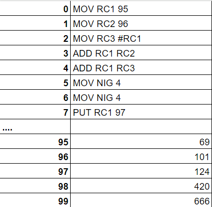

# Instructions

## Syntax

\<OPERATION> \<REGISTER> \<VALUE>\\\<ADDRESS>

To define an address, start it with the character "*"

## Instructions

MOV = **Loads** a value, value of an address, or an address into a register. 
PUT = **Stores** the register into memory. 
PRN = **Prints** the value of a register in the terminal. 
OBL = **OBLITERATES** the contents of a register. 
ADD = **Addition** operation. 
SUB = **Subtraction** operation. 
DIV = **Division** operation. 
MUL = **Multiplication** operation. 
MOD = **Modulo** operation. 
XXX = **A little surprise**.

## Registers

### Data Registers
| 64bit Register | 32bit Register  | 16bit Register | 8bit Register | Purpose |
|----------|----------|----------|----------|--------------|
| RA1         |  RB1        |  RC1        |  RD1        |  General purpose register 1        |
| RA2         |  RB2        |  RC2        |  RD2        |  General purpose register 2        |
| RA3         |  RB3        |  RC3        |  RD3        |  General purpose register 3        |
| RA4         |  RB4        |  RC4        |  RD4        |  General purpose register 4        |

### Other Registers
| Register | Purpose | Meaning |
|----------|---------|--------|
|   CIN   | Holds the current instruction   | **C**urrent **IN**struction |
|   NIG   | Holds the address of the next instruction    | **N**ext **I**nstruction **G**etter|
<!-- |   CIA   | Holds the address of the current instruction   | **C**urrent **I**nstruction **A**ddress |
-->

### Sample Instructions 

\<OPERATION> \<REGISTER> \<VALUE>\\\<ADDRESS>

MOV RC1 95 
MOV RC2 96 
MOV RC3 #RC1 
ADD RC1 RC2 
ADD RC1 RC3 
MOV NIG 4 
MOV NIG 4 
PUT RC1 97 

Result:
Value of 97 will become 377