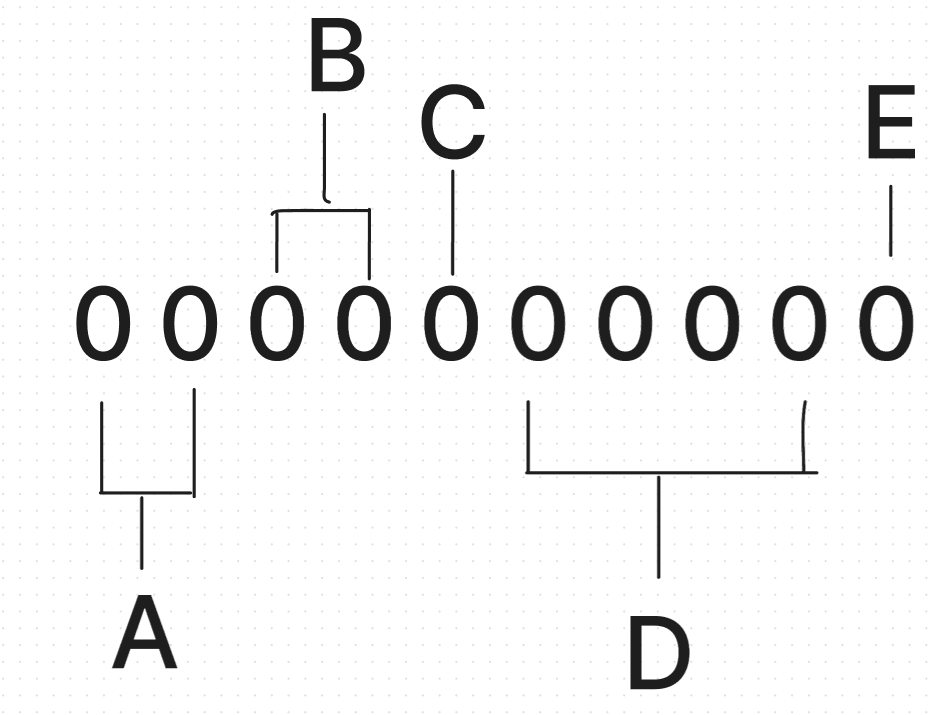

# Instructions

## Syntax

`<OPERATION> <REGISTER> <VALUE>\<ADDRESS>`

To define a value instead of an address, supposed you want to store the number `69` in memory address `50`, we will use `[]`.
Example: `PUT 50 [69]`
 

## Instructions

Instructions will be represented as a 2 digit Hexadecimal in memory for the sake of making it easier to understand. It will look like the following:
 

`0 1` MOV = **Loads** a value, value of an address, or an address into a register. 
`0 2` PUT = **Stores** the register into memory. 
`0 3` PRN = **Prints** the value of a register in the terminal. 
`0 4` OBL = **OBLITERATES** the contents of a register. 
`1 1` ADD = **Addition** operation. 
`1 2` SUB = **Subtraction** operation. 
`1 3` DIV = **Division** operation. 
`1 4` MUL = **Multiplication** operation. 
`1 5` MOD = **Modulo** operation. 
`2 1` GTN = Jump if **Greater than** operation.  
`2 2` LTN = Jump if **Less than** operation.  
`2 3` EQU = Jump if **Equals** operation  
`2 4` GEQ = Jump if **Greater than or Equals** operation.  
`2 5` LEQ = Jump if **Less than or Equals** operation.  
`2 6` XXX = **A little surprise**.

## Memory 
Values/Instructions stored in memory are stored as a 9 digit Hexadecimal.

**A**: First 2 digits signifies what operation the CPU must do. A value of `0 0` means that that particular memory location stores a value and not an instruction hence the first 5 digit will always be `0 0 0 0 0`.

 

**B**: The next 2 digits signifies the register than the operation the CPU will use.

 

The last 6 digits signifies the argument of the the operation. Each part of this 6 digits have its meaning.

* **C**: the 5th digit will only either be a `1` or a `0`. A `1` means that the remaining 4 digits will be a numerical value. A `0` signifies that the number stored in the next 4 digits is an address in the memory.

* **D**: The next 4 digits, as stated in **C** will contain either the value or the address that will be used as an argument for the operation dictated by **A**.

* **E**: This last digit will represent whether the numerical data in **D** is a positive or negative number. A value of `1` indicates that **D** is a negative number and a value of `0` indicates that it is a positive number.

Example: Supposed you want to load the value `69` into the **RA1** register and add it to the contents of the **RB1** register and store it into the memory location `44`.

Supposed RB1 contains the value `420`.

`MOV RA1 [69]`  
`ADD RB1 RA1`  
`PUT 44 RB1`  

That would look like this in memory:

`0`  : `0197100450` 
`1`  : `1196000970` 
`2`  : `022C100960` 
...  
`44` : `0000001E90` 

## Registers

### Data Registers
| 64bit Register | 32bit Register  | 16bit Register | 8bit Register | Purpose |
|----------|----------|----------|----------|--------------|
| RA1         |  RB1        |  RC1        |  RD1        |  General purpose register 1        |
| RA2         |  RB2        |  RC2        |  RD2        |  General purpose register 2        |
| RA3         |  RB3        |  RC3        |  RD3        |  General purpose register 3        |
| RA4         |  RB4        |  RC4        |  RD4        |  General purpose register 4        |

### Other Registers
| Register | Purpose | Meaning |
|----------|---------|--------|
|   CIR   | Holds the current instruction   | **C**urrent **I**struction **R**egister|
|   NIR   | Holds the address of the next instruction    | **N**ext **I**nstruction **R**egister|

<!-- |   CIA   | Holds the address of the current instruction   | **C**urrent **I**nstruction **A**ddress |
-->

## Sample Instructions 

`<OPERATION> <REGISTER> <VALUE>\<ADDRESS>`

### Add the 69 and 420 and place it in memory location 69

`MOV RA1 [69]`  
`MOV RA2 [420]`  
`ADD RA1 RA2`  
`PUT 69 RA1`  

Result:
Value of 69 will become 489  

### Put the numbers 1 - 10 in memory location 51 - 60 using a loop structure
`MOV RA1 [0]`  
`MOV RB1 [51]`  
`MOV RC1 [1]`  
`MOV RD1 [10]`  
`ADD RA1 RC1`  
`PUT RB1 RA1`  
`ADD RB1 RC1`  
`CMP RD1 RA1`  
`GTN CMP 4`  
`END 0 0`  

Result: 
The memory locations 51, 52, 53 .... 60 will have the values 1, 2, 3 .... 10 respectively

### Assembly FizzBuzz
Loop through the numbers 0 - 10 and place the results in memory location 50 - 60. if the number is an even number, put the value `0` in the memory location, if it is odd, put `1` otherwise.

`MOV RA1 [60]` 
`MOV RB1 [0]` 
`MOV RD1 [50]` 
`MOD RB1 [2]` 
`MOV RB2 [1]` 
`CMP RB1 RB2` 
`EQU CMP 8` 
`JMP 0 10` 
`PUT RD1 [1]`  
`JMP 0 11` 
`PUT RD1 [0]`  
`ADD RB1 [1]` 
`ADD RD1 [1]` 
`CMP RA1 RD1` 
`GEQ CMP 3` 
`END 0 0` 
